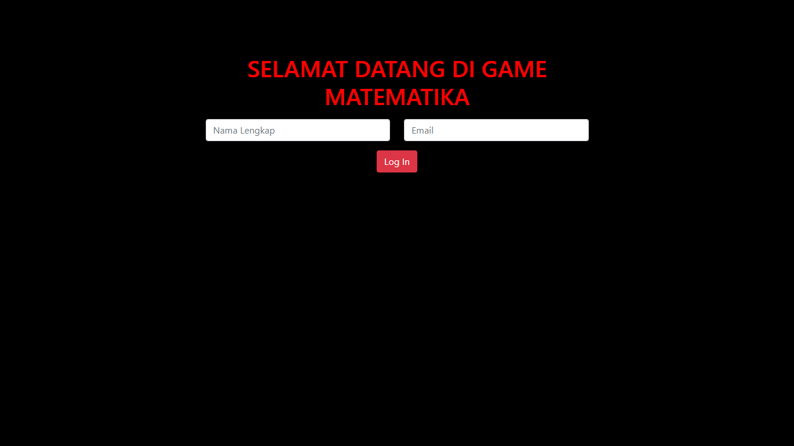
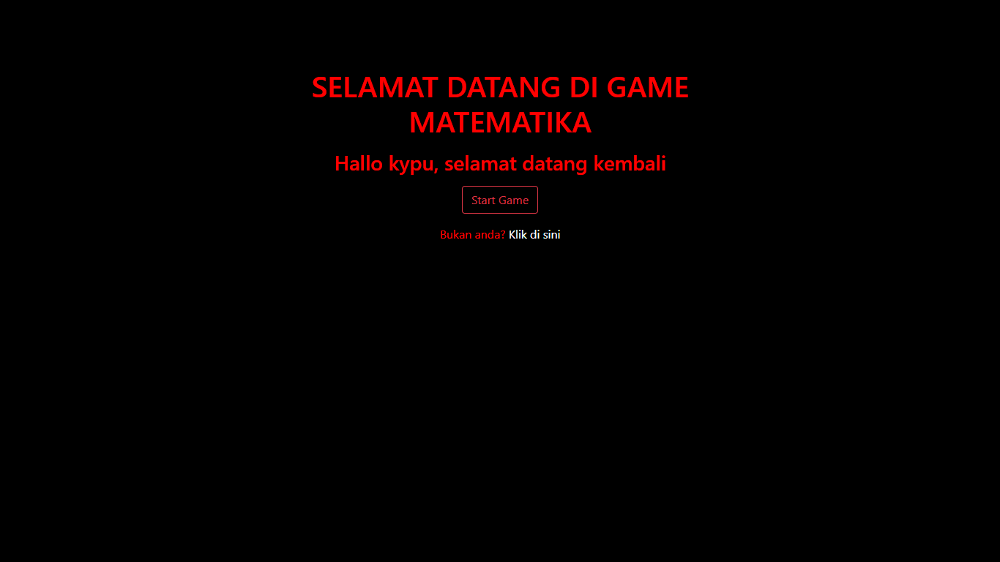
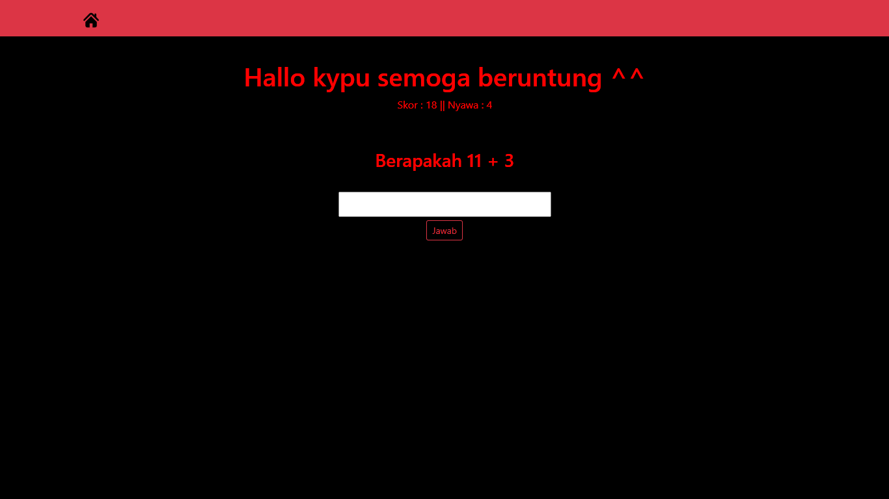
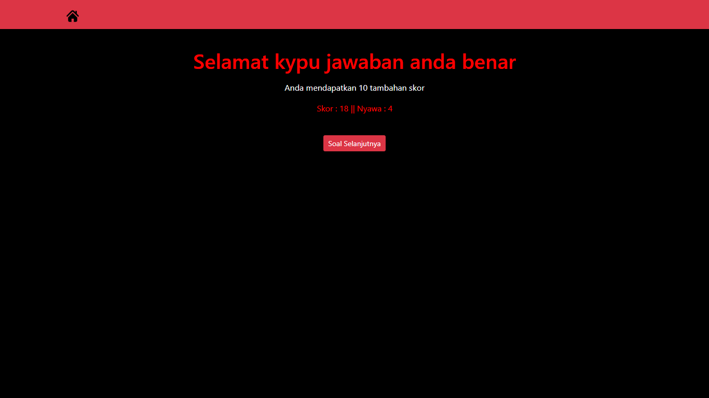
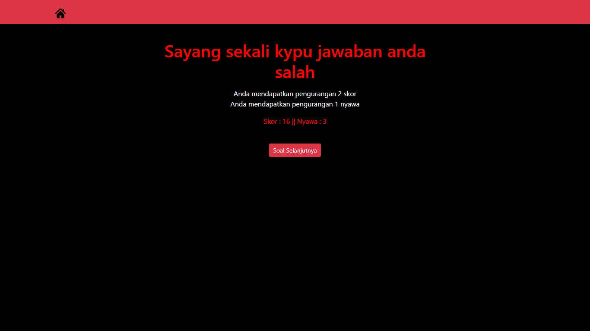

# UTS PEMROGRAMAN WEB
# Game Matematika
## Rizky Putu Ananda K3519073

Pada kali ini, dibuat sebuah game web sederhana menggunakan php. game ini akan merekam cookies dari nama untuk menyimpan data login. lalu digunakan mysqli untuk menyambungkan dari php ke database mysql.

 

# **Tampilan Login Website**

pada tampilan awal game, diberikan form login untuk memasukkan nama dan email

# **Tampilan Website Setelah Login**

setelah memasukkan nama dan email, akan tampil halaman home untuk memulai game

# **Tampilan Awal Game**

tampilan awal game yakni diberi soal dari random dua angka. pada game tampilan game, diberikan tombol home untuk kembali ke home dan logout jika perlu.

# **Tampilan Ketika Menjawab Dengan Benar**

jika menjawab benar, maka skor akan bertambah 10

# **Tampilan Ketika Menjawab Dengan Salah**

jika menjawab salah, maka skor akan berkurang 2 dan nyawa berkurang 1

# **Tampilan Ketika Nyawa Sudah Tersisa 0**

jika nyawa sudah mencapai 0, maka game akan berhenti dan menampilkan hall of fame dari 10 player teratas

 

## Link Website : http://www.kypu.epizy.com/
